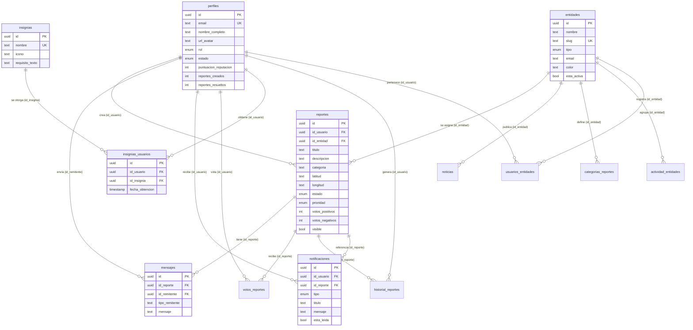
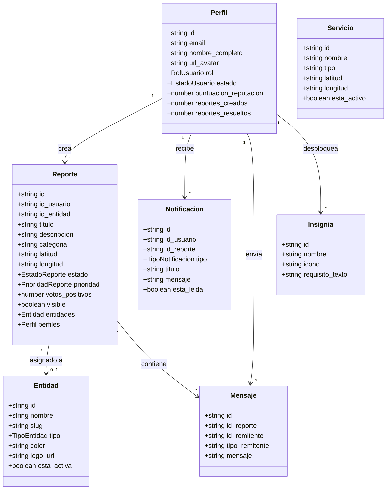
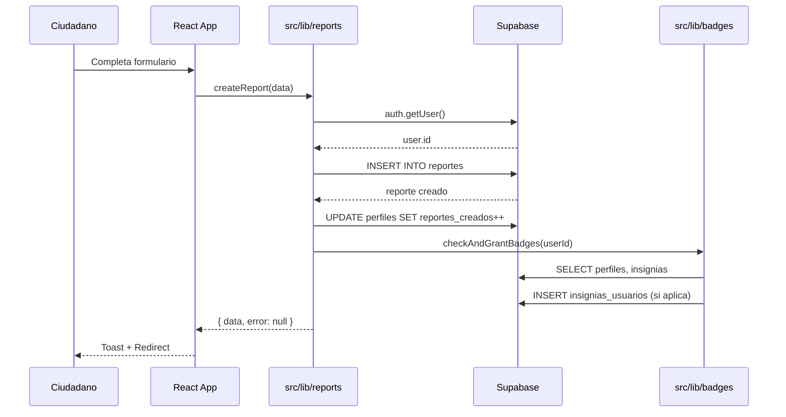

# 02 — Infraestructura y Base de Datos

## 🏗️ Arquitectura General

[](https://mermaid.live/edit#pako:eNp1kl1vmzAUhv-K5d5sGm2MQyigqVK-aDftoh3ZKg16YeAQUMBGxkzrov73GpNWTNF8xTl-3vd8mCPORA44wHvJ2hLtVglH-nR9OiYSHErBFfAcfYjulx8TPALDWcbfgWUKLdv2cypnNz8rBegT2kVP6PLyBq3iTmazukpn5nbNWoZyQBHI31VWie5p4mQEayMohTh0o6TvYNmr8gzcGJC17SwTTSs4cHVS_PiiGwh7rv05q-Gthm4_4WeTrVh2GAfrW5ayDv6ZbhsPtU_tgnH_-rjT9tuGVfWkpzC-F53aS4gevhnMdpBiac2mE97GkRKS7UcjB6W9rq2mxN2wzVpVzYg8QhqJgTkfYWWWsJ0G4TS4HYP1FNuY4O59C-q5Br3Noqrr4MImqe_ZViZqIYOLoiimUHiC5qlHC_c_0PYEFQsfSDqBsKX_rCrHgZI9WLgBqbenQ3wc5AlWJTSQ4EB_5kwehgd40ZqW8V9CNG8yKfp9iYOC1Z2O-jZnCjYV0w_ZvGel3hDItei5woHjGg8cHPEfHMzJ9RWlZOF5LqWuTx0LP-PA9qnOuuSaUGo7HiHui4X_mqrkyp0Tm_rOwl1QQjx99QqzZu88)

---

## 📊 Diagrama Entidad-Relación



---

## 📋 Detalle de Tablas

### 1. `perfiles`
> Enlazada 1:1 con `auth.users` vía FK en `id`.

| Columna | Tipo | Default | Descripción |
|---|---|---|---|
| `id` | `uuid` PK | `uuid_generate_v4()` | ID del usuario (=auth.users.id) |
| `email` | `text` UNIQUE | — | Email del usuario |
| `nombre_completo` | `text` | null | Nombre visible |
| `telefono` | `text` | null | Teléfono de contacto |
| `url_avatar` | `text` | null | URL pública del avatar (bucket `avatars`) |
| `rol` | `rol_usuario` | `'ciudadano'` | `ciudadano` \| `entidad` \| `moderador` \| `administrador` |
| `estado` | `estado_usuario` | `'activo'` | `activo` \| `inactivo` \| `suspendido` |
| `puntuacion_reputacion` | `int` | 0 | Votos positivos − votos negativos acumulados |
| `votos_positivos` | `int` | 0 | Total votos positivos recibidos en reportes |
| `votos_negativos` | `int` | 0 | Total votos negativos recibidos en reportes |
| `reportes_creados` | `int` | 0 | Contador de reportes creados |
| `reportes_resueltos` | `int` | 0 | Contador de reportes marcados como resueltos |
| `motivo_bloqueo` | `text` | null | Razón del bloqueo/suspensión (si aplica) |
| `fecha_creacion` | `timestamptz` | `now()` | — |
| `fecha_actualizacion` | `timestamptz` | `now()` | — |

### 2. `entidades`
| Columna | Tipo | Default | Descripción |
|---|---|---|---|
| `id` | `uuid` PK | auto | — |
| `nombre` | `text` NOT NULL | — | Nombre de la entidad gubernamental |
| `slug` | `text` UNIQUE | — | Identificador URL-friendly |
| `descripcion` | `text` | null | — |
| `tipo` | `tipo_entidad` | — | `servicios-publicos` \| `seguridad` \| `salud` \| `infraestructura` \| `ambiente` \| `otro` |
| `email` | `text` | null | Email institucional |
| `telefono` | `text` | null | — |
| `color` | `text` | null | Color hex para branding |
| `logo_url` | `text` | null | URL pública del logo (bucket `logos`) |
| `sitio_web` | `text` | null | — |
| `esta_activa` | `bool` | true | — |

### 3. `reportes`
| Columna | Tipo | Default | Descripción |
|---|---|---|---|
| `id` | `uuid` PK | auto | — |
| `id_usuario` | `uuid` FK→perfiles | — | Ciudadano que creó el reporte |
| `id_entidad` | `uuid` FK→entidades | null | Entidad asignada para resolución |
| `titulo` | `text` NOT NULL | — | — |
| `descripcion` | `text` NOT NULL | — | — |
| `categoria` | `text` NOT NULL | — | `alumbrado` \| `basura` \| `transporte` \| `agua` \| `vias` \| `seguridad` \| `salud` |
| `direccion_ubicacion` | `text` | null | Dirección en texto libre |
| `latitud` | `text` | null | Coordenada GPS |
| `longitud` | `text` | null | Coordenada GPS |
| `url_imagen` | `text` | null | URL foto evidencia (bucket `report-images`) |
| `estado` | `estado_reporte` | `'pendiente'` | `pendiente` \| `en_revision` \| `en_proceso` \| `resuelto` \| `cancelado` |
| `prioridad` | `prioridad_reporte` | `'media'` | `baja` \| `media` \| `alta` \| `critica` |
| `votos_positivos` | `int` | 0 | — |
| `votos_negativos` | `int` | 0 | — |
| `visto` | `bool` | false | Flag para UI de "no leído" |
| `visible` | `bool` | true | Soft-delete: false oculta del mapa público |

### 4. `mensajes`
| Columna | Tipo | Default | Descripción |
|---|---|---|---|
| `id` | `uuid` PK | auto | — |
| `id_reporte` | `uuid` FK→reportes | — | Reporte al que pertenece |
| `id_remitente` | `uuid` FK→perfiles | — | Quién envió el mensaje |
| `tipo_remitente` | `text` | `'usuario'` | `usuario` \| `entidad` \| `moderador` |
| `mensaje` | `text` NOT NULL | — | Contenido del mensaje |

### 5. `notificaciones`
| Columna | Tipo | Default | Descripción |
|---|---|---|---|
| `id` | `uuid` PK | auto | — |
| `id_usuario` | `uuid` FK→perfiles | — | Destinatario |
| `id_reporte` | `uuid` FK→reportes | null | Reporte relacionado (opcional) |
| `tipo` | `tipo_notificacion` | — | `reporte_actualizado` \| `nuevo_mensaje` \| `reporte_resuelto` \| `mencion` \| `alerta_sistema` |
| `titulo` | `text` NOT NULL | — | — |
| `mensaje` | `text` NOT NULL | — | — |
| `esta_leida` | `bool` | false | — |

### 6. `votos_reportes`
| Columna | Tipo | Constraint |
|---|---|---|
| `id` | `uuid` PK | — |
| `id_reporte` | `uuid` FK→reportes | — |
| `id_usuario` | `uuid` FK→perfiles | — |
| `tipo_voto` | `text` | CHECK: `'voto_positivo'` o `'voto_negativo'` |

### 7. `insignias`
| Columna | Tipo | Descripción |
|---|---|---|
| `id` | `uuid` PK | — |
| `nombre` | `text` UNIQUE | Ej: `Primer Reporte`, `10 Reportes`, `Embajador` |
| `icono` | `text` | Emoji o código de icono |
| `requisito_texto` | `text` | Descripción del requisito para desbloquear |

### 8. `insignias_usuarios`
Tabla pivote M:N entre `perfiles` e `insignias`.

### 9. `servicios`
Puntos de interés municipal mostrados en el mapa.

| Columna | Tipo | Descripción |
|---|---|---|
| `nombre` | `text` | Nombre del servicio |
| `tipo` | `text` | `salud` \| `seguridad` \| `educacion` \| `transporte` \| `recreacion` \| `administrativo` \| `otro` |
| `latitud`/`longitud` | `text` | Coordenadas |
| `direccion` | `text` | — |
| `horario` | `text` | Horario de atención |
| `telefono` | `text` | — |
| `esta_activo` | `bool` | — |

### 10. `noticias`
| Columna | Tipo | Descripción |
|---|---|---|
| `id_entidad` | `uuid` FK | Entidad que publica |
| `titulo` | `text` | — |
| `contenido` | `text` | Cuerpo de la noticia |
| `url_imagen` | `text` | Imagen de portada (bucket `news`) |
| `esta_publicada` | `bool` | false = borrador |
| `categoria` | `text` | Categoría temática |

### 11-14. Tablas auxiliares
- **`historial_reportes`**: Log de cambios de estado en reportes.
- **`categorias_reportes`**: Categorías dinámicas con icono y color.
- **`actividad_entidades`**: Auditoría de acciones de entidades.
- **`usuarios_entidades`**: Membresía de usuarios a entidades.

---

## 🗄️ Supabase Storage (Buckets)

| Bucket | Uso | Formato |
|---|---|---|
| `avatars` | Fotos de perfil de usuarios | `{userId}-{timestamp}.{ext}` |
| `report-images` | Evidencia fotográfica de reportes | `{reportId}-{timestamp}.{ext}` |
| `news` | Imágenes de portada de noticias | `{newsId}-{timestamp}.{ext}` |
| `logos` | Logos de entidades gubernamentales | `{entityId}-{timestamp}.{ext}` |

---

## 🔄 Supabase Realtime

Se usan canales de Realtime para suscripción en vivo:

| Canal | Tabla | Evento | Componente |
|---|---|---|---|
| `admin_report_chat_{reportId}` | `mensajes` | `INSERT/UPDATE/DELETE` | `ReportsManagement` |
| `notifications_{userId}` | `notificaciones` | `INSERT` | `NotificationBell` |
| `report_chat_{reportId}` | `mensajes` | `*` | `ReportDetailPage`, `EntityReportDetail` |

---

## 🔐 Enumeraciones (ENUM en PostgreSQL)

```sql
-- Roles de usuario
CREATE TYPE rol_usuario AS ENUM ('ciudadano', 'entidad', 'moderador', 'administrador');

-- Estados de usuario
CREATE TYPE estado_usuario AS ENUM ('activo', 'inactivo', 'suspendido');

-- Estados de reporte
CREATE TYPE estado_reporte AS ENUM ('pendiente', 'en_revision', 'en_proceso', 'resuelto', 'cancelado');

-- Prioridad de reporte
CREATE TYPE prioridad_reporte AS ENUM ('baja', 'media', 'alta', 'critica');

-- Tipo de entidad
CREATE TYPE tipo_entidad AS ENUM ('servicios-publicos', 'seguridad', 'salud', 'infraestructura', 'ambiente', 'otro');

-- Tipo de notificación
CREATE TYPE tipo_notificacion AS ENUM ('reporte_actualizado', 'nuevo_mensaje', 'reporte_resuelto', 'mencion', 'alerta_sistema');
```

---

## 📐 Diagrama de Clases TypeScript



---

## 🔀 Flujo de datos: Crear Reporte


