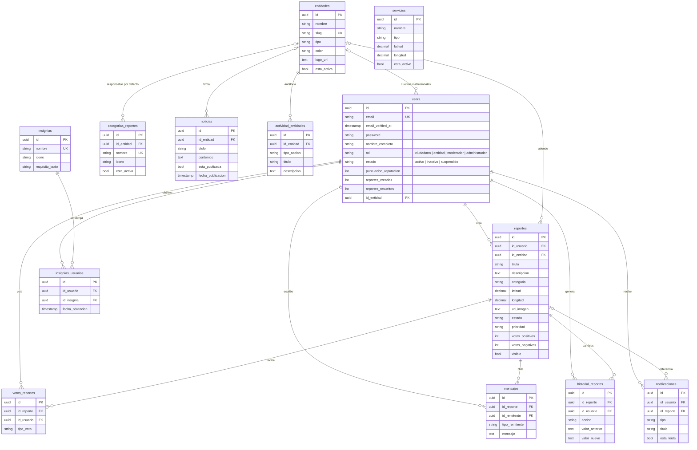

# 02 · Base de datos

Motor: **PostgreSQL** (base `buenaventura_reporta`). El esquema se define con las **migraciones de Laravel** en `database/migrations`; son la fuente de verdad. Los scripts de [`sql/`](sql/) se generan a partir de ellas.

---

## Diagrama entidad-relación



> `servicios` no tiene relaciones: son puntos de interés independientes que se muestran en el mapa.

---

## Tablas del dominio

| Tabla | Modelo | Qué guarda |
|---|---|---|
| `users` | `User` | Cuentas y perfil (reemplaza a `auth.users` + `perfiles` de Supabase): credenciales, rol, estado, motivo de bloqueo, contadores de reputación y la entidad de las cuentas institucionales (`id_entidad`). |
| `entidades` | `Entidad` | Instituciones que atienden reportes. `slug` único, `color` y `logo_url` para su panel. |
| `categorias_reportes` | `CategoriaReporte` | Tipos de incidencia que puede elegir el ciudadano. `id_entidad` es la entidad responsable **por defecto**. |
| `reportes` | `Reporte` | Reportes ciudadanos. `categoria` guarda el **nombre** de la categoría (no su id), igual que en Supabase. `visible = false` es un reporte eliminado. |
| `votos_reportes` | `VotoReporte` | Un voto por usuario y reporte (índice único). Se puede cambiar de positivo a negativo, no duplicar. |
| `mensajes` | `Mensaje` | Chat de seguimiento de cada reporte. |
| `historial_reportes` | `HistorialReporte` | Auditoría del reporte: creación, cambios de estado, asignación de entidad. |
| `notificaciones` | `Notificacion` | Avisos de la campana del panel. |
| `insignias` | `Insignia` | Catálogo de insignias (gamificación). |
| `insignias_usuarios` | `InsigniaUsuario` | Insignias ganadas por cada usuario (índice único usuario + insignia). |
| `noticias` | `Noticia` | Noticias publicadas por la administración, opcionalmente firmadas por una entidad. |
| `servicios` | `Servicio` | Puntos de interés del mapa (hospitales, estaciones, parques…). |
| `actividad_entidades` | `ActividadEntidad` | Auditoría del panel institucional: inicios de sesión, cambios de estado, edición del perfil. |

Tablas propias de Laravel: `migrations`, `password_reset_tokens`, `sessions`, `cache`, `cache_locks`, `jobs`, `job_batches`, `failed_jobs`.

### Reglas de borrado

| Si se borra… | Efecto |
|---|---|
| Un usuario | Se borran en cascada sus reportes, votos, mensajes, notificaciones e insignias. En `historial_reportes` su id queda en `NULL`. |
| Una entidad | Sus reportes, categorías, noticias y cuentas quedan sin entidad (`NULL`); su auditoría se borra. El controlador además desactiva sus cuentas. |
| Un reporte (fila) | Se borran sus votos, mensajes, historial y notificaciones. En la práctica la API no borra filas: hace borrado lógico con `visible = false`. |

---

## Valores permitidos

Se validan con restricciones `CHECK` en PostgreSQL y con los enums de `app/Enums`.

| Columna | Valores | Enum |
|---|---|---|
| `users.rol` | `ciudadano`, `entidad`, `moderador`, `administrador` | `RolUsuario` |
| `users.estado` | `activo`, `inactivo`, `suspendido` | `EstadoUsuario` |
| `entidades.tipo` | `servicios-publicos`, `seguridad`, `salud`, `infraestructura`, `ambiente`, `otro` | `TipoEntidad` |
| `reportes.estado` | `pendiente`, `en_revision`, `en_proceso`, `resuelto`, `cancelado` | `EstadoReporte` |
| `reportes.prioridad` | `baja`, `media`, `alta`, `critica` | `PrioridadReporte` |
| `votos_reportes.tipo_voto` | `voto_positivo`, `voto_negativo` | `TipoVoto` |
| `mensajes.tipo_remitente` | `usuario`, `entidad`, `moderador` | `TipoRemitente` |
| `notificaciones.tipo` | `reporte_actualizado`, `nuevo_mensaje`, `reporte_resuelto`, `mencion`, `alerta_sistema` | `TipoNotificacion` |
| `servicios.tipo` | Texto libre. El frontend usa `salud`, `seguridad`, `educacion`, `transporte`, `recreacion`, `administrativo`, `otro`. | — |

---

## Migraciones

| Archivo | Crea |
|---|---|
| `0001_01_01_000000_create_users_table` | `users`, `password_reset_tokens`, `sessions` |
| `0001_01_01_000001_create_cache_table` | `cache`, `cache_locks` |
| `0001_01_01_000002_create_jobs_table` | `jobs`, `job_batches`, `failed_jobs` |
| `2026_09_28_000001_create_entidades_table` | `entidades` + llave foránea `users.id_entidad` |
| `2026_09_28_000002_create_categorias_reportes_table` | `categorias_reportes` |
| `2026_09_28_000003_create_reportes_table` | `reportes`, `votos_reportes`, `mensajes`, `historial_reportes` |
| `2026_09_28_000004_create_notificaciones_table` | `notificaciones` |
| `2026_09_28_000005_create_insignias_tables` | `insignias`, `insignias_usuarios` |
| `2026_09_28_000006_create_noticias_y_servicios_tables` | `noticias`, `servicios` |
| `2026_10_01_000001_create_actividad_entidades_table` | `actividad_entidades` |

### Agregar una migración

1. `php artisan make:migration add_columna_x_to_reportes_table`
2. Escribe `up()` y `down()` siguiendo las convenciones: UUID como llave, `timestampTz('fecha_creacion')`, nombres en español.
3. `php artisan migrate` y `php artisan test`.
4. Regenera los scripts SQL (sección siguiente) para que la documentación no quede desactualizada.

---

## Seeders

| Seeder | Crea | Cuándo corre |
|---|---|---|
| `CatalogoSeeder` | 6 entidades (Aseo, Movilidad, Acueducto, Obras Públicas, Policía, Bomberos), 7 categorías con su entidad responsable y 5 insignias | Siempre |
| `DatabaseSeeder` | Llama a `CatalogoSeeder` y crea el administrador (`ADMIN_EMAIL` / `ADMIN_PASSWORD`) | `php artisan db:seed` |
| `DatosDemoSeeder` | Ciudadano `ciudadano@buenaventura.local` (contraseña `password`), 5 servicios del mapa, 2 noticias y 3 reportes de ejemplo | Solo con `APP_ENV=local` |

Todos usan `updateOrCreate` o comprueban si el registro existe, así que se pueden ejecutar varias veces sin duplicar.

### Categorías y entidad responsable por defecto

| Categoría | Entidad |
|---|---|
| Luminaria dañada | Secretaría de Obras Públicas |
| Hueco en la vía | Secretaría de Obras Públicas |
| Basura en vía pública | Empresa de Aseo Municipal |
| Semáforo dañado | Secretaría de Movilidad |
| Fuga de agua | Acueducto Municipal |
| Incendio | Cuerpo de Bomberos |
| Alteración del orden público | Policía Nacional |

### Insignias

| Insignia | Requisito |
|---|---|
| Primer Reporte | Crear 1 reporte |
| 10 Reportes | Crear 10 reportes |
| 50 Reportes | Crear 50 reportes |
| Solucionador | Tener 1 reporte resuelto |
| Embajador | Alcanzar 100 puntos de reputación |

Los nombres deben coincidir con las reglas de `App\Services\InsigniaService`.

---

## Scripts SQL

En [`sql/`](sql/), para quien prefiera crear la base desde `psql` o pgAdmin. Su uso está explicado en la [guía de instalación](GUIA-DE-INSTALACION.md#8-crear-la-base-de-datos).

| Script | Contenido | Se ejecuta conectado a |
|---|---|---|
| `01-crear-base-de-datos.sql` | `CREATE DATABASE buenaventura_reporta` (y un usuario propio, comentado) | `postgres` |
| `02-esquema.sql` | Tablas, índices, llaves foráneas y registro de las 10 migraciones en `migrations` | `buenaventura_reporta` |
| `03-datos-catalogo.sql` | Entidades, categorías e insignias de `CatalogoSeeder` | `buenaventura_reporta` |

Ninguno crea usuarios: después hay que correr `php artisan db:seed`. Se verificaron el 5 de octubre de 2026 sobre PostgreSQL 18: tras ejecutarlos, `php artisan migrate:status` muestra las 10 migraciones aplicadas y `db:seed` crea el administrador sin duplicar el catálogo.

### Regenerar los scripts SQL

Cuando cambien las migraciones o el `CatalogoSeeder`, genera de nuevo `02` y `03` desde una base temporal (no toca tu base de trabajo):

```bash
# Desde la carpeta Buenaventura-Reporta-API
createdb -U postgres br_temporal
set DB_DATABASE=br_temporal
php artisan migrate --force
php artisan db:seed --class=CatalogoSeeder --force

pg_dump -U postgres --schema-only --no-owner --no-privileges br_temporal > esquema.sql
pg_dump -U postgres --data-only --no-owner --no-privileges --inserts -t migrations br_temporal > migraciones.sql
pg_dump -U postgres --data-only --no-owner --no-privileges --column-inserts -t entidades -t categorias_reportes -t insignias br_temporal > catalogo.sql

set DB_DATABASE=
dropdb -U postgres br_temporal
```

Luego copia el contenido a `02-esquema.sql` (esquema + migraciones) y `03-datos-catalogo.sql`, conservando sus encabezados. Si usas `pg_dump` 17 o superior, **borra las líneas `\restrict …`, `\unrestrict …` y `SET transaction_timeout = 0;`**: pgAdmin y las versiones anteriores de PostgreSQL no las entienden.

> En PowerShell usa `$env:DB_DATABASE="br_temporal"` en lugar de `set`.
