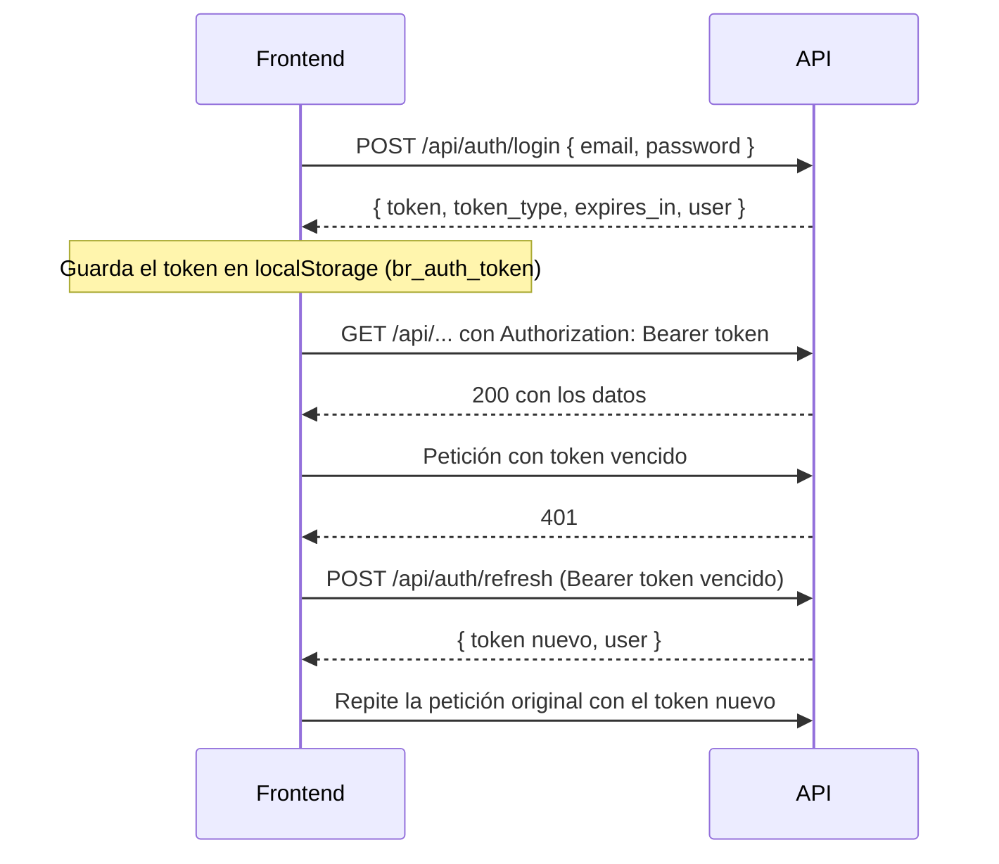

# 03 · Autenticación y seguridad

## Resumen

| Tema | Cómo funciona |
|---|---|
| Sesión | Token **JWT** (`tymon/jwt-auth`, guard `api`) enviado en `Authorization: Bearer <token>`. Sin cookies. |
| Vigencia | El token dura `JWT_TTL` (60 min). Se puede renovar hasta `JWT_REFRESH_TTL` (2 semanas) después de emitido. |
| Registro | Solo crea ciudadanos y exige **verificar el correo** antes de iniciar sesión. |
| Bloqueo | Una cuenta `suspendida` o `inactiva` queda fuera **de inmediato**, aunque tenga un token vigente. |
| Roles | `ciudadano`, `entidad`, `moderador`, `administrador`. |
| Permisos finos | `ReportePolicy` (quién gestiona, cambia el estado o chatea en un reporte). |
| Abuso | Límite de peticiones por minuto en las rutas sensibles. |
| CORS | Solo los orígenes de `FRONTEND_URL` / `CORS_ALLOWED_ORIGINS`. |

---

## Flujo de sesión



- **Login** (`POST /auth/login`) comprueba, en este orden: credenciales → correo verificado → cuenta activa. Si la cuenta es de una entidad, registra el inicio de sesión en su auditoría.
- **Refresh** (`POST /auth/refresh`) no usa el middleware `auth:api` a propósito: acepta tokens ya vencidos mientras estén dentro de `JWT_REFRESH_TTL`. También rechaza cuentas bloqueadas.
- **Logout** (`POST /auth/logout`) invalida el token en el servidor.
- **`GET /auth/me`** devuelve el perfil completo del usuario autenticado. El frontend lo llama al cargar la app para restaurar la sesión.

El frontend renueva el token automáticamente en `src/api/client.ts` (un interceptor de Axios que reintenta una sola vez y comparte la renovación entre peticiones simultáneas).

---

## Verificación de correo

1. `POST /auth/register` crea la cuenta con rol `ciudadano` y envía el correo `VerificarCorreo`.
2. El correo trae una **URL firmada del backend** (`GET /auth/verify-email/{id}/{hash}`) que vence a los 60 minutos.
3. Al abrirla, la API marca el correo como verificado y **redirige al frontend**: `FRONTEND_URL/login?verificado=ok` o `?verificado=invalido`.
4. `POST /auth/email/resend` reenvía el correo. Responde lo mismo exista o no la cuenta, para no revelar qué correos están registrados.

Las cuentas de entidad que crea la administración nacen verificadas.

## Recuperación de contraseña

1. `POST /auth/forgot-password { email }` envía el correo `RestablecerPassword`. La respuesta no revela si el correo existe.
2. El enlace apunta al **frontend**: `FRONTEND_URL/reset-password?token=...&email=...`. El token vence a los 60 minutos.
3. El frontend envía `POST /auth/reset-password { token, email, password }` (mínimo 8 caracteres; la confirmación se valida en el formulario del frontend).

En desarrollo (`MAIL_MAILER=log`) los dos correos se escriben en `storage/logs/laravel.log`.

---

## Roles y middleware

Alias registrados en `bootstrap/app.php`:

| Alias | Clase | Qué exige |
|---|---|---|
| `auth:api` | (Laravel + JWT) | Token válido. Si no, `401 { "message": "No autenticado. Inicia sesión nuevamente." }` |
| `activo` | `EnsureUserIsActive` | Cuenta `activo`. Si no, invalida el token y responde `403` con `codigo: cuenta_inactiva`. |
| `rol:...` | `EnsureUserHasRole` | Uno de los roles indicados. Ej.: `rol:administrador`. |
| `con_entidad` | `EnsureUserHasEntity` | Rol `entidad` **y** cuenta vinculada a una entidad existente (`codigo: sin_entidad` si no). |

| Rol | Puede |
|---|---|
| `ciudadano` | Todo el panel ciudadano: reportar, votar, chatear en sus reportes, notificaciones, perfil. |
| `entidad` | Panel de entidad (`/entity/*`), cambiar el estado y chatear en los reportes **asignados a su entidad**. |
| `moderador` | Cambiar el estado y chatear en cualquier reporte (vía `ReportePolicy`). No tiene acceso a `/admin`. |
| `administrador` | Todo lo anterior y el panel `/admin/*`. |

### `ReportePolicy`

| Habilidad | Quién |
|---|---|
| `gestionar` (subir imagen, eliminar) | Solo el autor del reporte. |
| `cambiarEstado` | Administrador, moderador o la entidad asignada al reporte. |
| `participarEnChat` | Autor, administrador, moderador o la entidad asignada. |

Además, en el chat solo el autor de un mensaje puede editarlo o borrarlo, y solo durante los primeros **5 minutos** (`Mensaje::MINUTOS_EDICION`).

### Visibilidad de datos

- `GET /users/{id}`: el propio usuario recibe su perfil completo; los demás solo los datos públicos (sin correo ni teléfono, `PerfilPublicoResource`).
- `GET /reports/{id}`: un reporte eliminado (`visible = false`) solo lo ven su autor y la administración.
- Las notificaciones de otro usuario se tratan como inexistentes (404).

---

## Límites de peticiones (throttling)

| Rutas | Límite por minuto |
|---|---|
| `auth/login`, `auth/register`, `auth/refresh`, `auth/verify-email` | 10 |
| `auth/forgot-password`, `auth/reset-password`, `auth/email/resend` | 5 |
| `POST reports` | 10 |
| `POST reports/{id}/votes` | 30 |
| `POST reports/{id}/messages` | 20 |
| `POST users/{id}/report-abuse` | 5 |

Al superarlos la API responde `429 Too Many Requests`.

---

## CORS

`config/cors.php` permite solo las rutas `api/*` y los orígenes de `CORS_ALLOWED_ORIGINS` (separados por coma) o, si no está definida, `FRONTEND_URL`. Como la autenticación va por token y no por cookies, `supports_credentials` está en `false`.

Para el frontend desplegado, agrega su dominio:

```dotenv
CORS_ALLOWED_ORIGINS=https://tu-dominio-del-frontend,http://localhost:5173
```

---

## Archivos subidos

`App\Support\ArchivosPublicos` guarda las imágenes en el disco `public` (`storage/app/public`, servido en `APP_URL/storage`) con nombre UUID, y borra la anterior al reemplazarla.

| Archivo | Ruta | Formatos | Tamaño máximo |
|---|---|---|---|
| Foto de reporte | `POST reports/{id}/image` | jpg, jpeg, png, webp | 5 MB |
| Avatar | `POST users/me/avatar` | jpg, jpeg, png, webp | 2 MB |
| Logo de entidad | `POST entity/logo` | jpg, jpeg, png, webp | 2 MB |
| Imagen de noticia | `POST admin/news/{id}/image` | jpg, jpeg, png, webp | 5 MB |

Requiere `php artisan storage:link`.

---

## Códigos de error

Todos los errores bajo `/api` son JSON con `message`. Algunos traen `codigo` para que el frontend reaccione:

| HTTP | `codigo` | Cuándo | Qué hace el frontend |
|---|---|---|---|
| 401 | `credenciales_invalidas` | Correo o contraseña incorrectos | Muestra el mensaje. |
| 403 | `correo_no_verificado` | Login sin haber verificado el correo | Ofrece "Reenviar correo". |
| 403 | `cuenta_inactiva` | Cuenta suspendida o inactiva (login, refresh o cualquier ruta con `activo`). Incluye `estado` y `motivo_bloqueo`. | Cierra la sesión y muestra el motivo. |
| 403 | `sin_entidad` | Cuenta de entidad sin entidad vinculada | Muestra el mensaje. |
| 401 | — | Token ausente, inválido o vencido | Intenta `refresh`; si falla, cierra la sesión. |
| 403 | — | Rol o política no lo permiten | Muestra el mensaje. |
| 404 | — | Recurso inexistente o id que no es UUID | — |
| 422 | — | Validación (`errors` por campo, mensajes en español) | Muestra el primer error. |
| 429 | — | Límite de peticiones superado | — |
