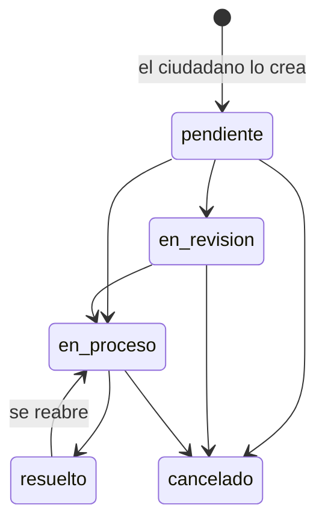

# 05 · Lógica de negocio

Las reglas que no son simple lectura o escritura viven en `app/Services`. Los controladores validan la petición, comprueban permisos (middleware y `ReportePolicy`) y delegan en estos servicios.

| Servicio | Responsabilidad |
|---|---|
| `GestionReportesService` | Cambiar el estado de un reporte y asignarlo a una entidad. |
| `VotacionService` | Registrar votos y recalcular votos del reporte y reputación del autor. |
| `InsigniaService` | Otorgar las insignias que el usuario ya cumple. |
| `Notificador` | Crear notificaciones internas (campana) para uno o muchos usuarios. |
| `App\Support\ArchivosPublicos` | Guardar y borrar imágenes en el disco público. |
| `App\Models\ActividadEntidad::registrar()` | Escribir en la auditoría del panel de entidad. |

---

## Ciclo de vida de un reporte

La API no impone un orden entre estados: quien tiene permiso (administración, moderación o la entidad asignada) puede pasar a cualquiera. El diagrama muestra el uso esperado. Además, el reporte puede ocultarse en cualquier momento (`visible = false`) por su autor o por la administración.

### Crear un reporte (`ReporteController@store`)

1. Valida con `StoreReporteRequest`: `titulo` (máx. 150), `descripcion` (máx. 5000), `categoria` (debe existir y estar activa), coordenadas opcionales, `prioridad` y `id_entidad` opcionales.
2. Si no llega `id_entidad`, toma la **entidad responsable de la categoría** (`categorias_reportes.id_entidad`).
3. En una transacción: guarda el reporte con estado `pendiente`, suma 1 a `users.reportes_creados` y registra `creado` en `historial_reportes`.
4. Evalúa las insignias del autor (por ejemplo, *Primer Reporte*).
5. La foto se sube aparte con `POST /reports/{id}/image`, una vez creado el reporte.

### Cambio de estado (`GestionReportesService::cambiarEstado`)

Si el estado nuevo es igual al actual, no hace nada. Si cambia:

1. En una transacción: guarda el estado, marca `visto = true` y registra `cambio_estado` (anterior → nuevo) en el historial.
2. Mantiene el contador `reportes_resueltos` del autor: +1 al pasar a `resuelto`, −1 si sale de `resuelto`.
3. Si quedó `resuelto`, evalúa las insignias del autor (*Solucionador*).
4. Si el reporte tiene entidad, escribe en su auditoría quién hizo el cambio (el correo de la cuenta de la entidad o "la administración").
5. Notifica al autor: tipo `reporte_resuelto` si se resolvió, `reporte_actualizado` en otro caso.

### Asignar entidad (`GestionReportesService::asignarEntidad`)

Solo la administración (`PATCH /admin/reports/{id}/entity`). Guarda la entidad, registra `asignacion_entidad` en el historial y en la auditoría de la entidad, y notifica al autor y a todas las cuentas de la entidad.

---

## Votos y reputación (`VotacionService`)

- Un usuario tiene **un voto por reporte**: puede cambiarlo de positivo a negativo (o al revés), pero votar lo mismo dos veces responde 422.
- La operación bloquea la fila del voto (`lockForUpdate`) dentro de una transacción para evitar dobles votos simultáneos.
- Después de cada voto se **recalculan desde cero** (no se suma ni se resta):
  - `reportes.votos_positivos` y `votos_negativos` del reporte.
  - `users.votos_positivos`, `votos_negativos` y **`puntuacion_reputacion` = positivos − negativos** de todos los reportes del autor.
- Se evalúan las insignias del autor (*Embajador* con 100 puntos).
- Si quien vota no es el autor, se le notifica con tipo `mencion` ("Alguien ha dado un voto positivo a tu reporte").

---

## Insignias (`InsigniaService::evaluar`)

Recibe un usuario, revisa qué reglas cumple y le asigna las que todavía no tiene (con `fecha_obtencion`). Se llama al crear un reporte, al recibir votos y al resolverse un reporte.

| Insignia | Regla |
|---|---|
| Primer Reporte | `reportes_creados >= 1` |
| 10 Reportes | `reportes_creados >= 10` |
| 50 Reportes | `reportes_creados >= 50` |
| Solucionador | `reportes_resueltos >= 1` |
| Embajador | `puntuacion_reputacion >= 100` |

Para agregar una insignia: créala en `CatalogoSeeder` y agrega su regla en `InsigniaService::reglas()` **con el mismo nombre**.

---

## Notificaciones (`Notificador`)

`notificar($idsUsuarios, $tipo, $titulo, $mensaje, $reporte = null)` inserta las notificaciones por bloques de 500, así que un aviso a todos los ciudadanos es una sola operación rápida. El frontend las consulta cada 30 segundos (no hay websockets).

| Evento | Destinatarios | Tipo |
|---|---|---|
| Cambio de estado | Autor del reporte | `reporte_actualizado` o `reporte_resuelto` |
| Reporte asignado a una entidad | Autor y cuentas de la entidad | `reporte_actualizado` |
| Voto de otra persona | Autor del reporte | `mencion` |
| Mensaje en el chat | Administradores (menos quien escribe); el autor si escribió otra persona; las cuentas de la entidad si no escribió la entidad | `nuevo_mensaje` |
| Denuncia de un usuario | Todos los administradores | `alerta_sistema` |
| Noticia publicada por primera vez | Todos los ciudadanos activos | `alerta_sistema` |
| Servicio creado activo | Todos los ciudadanos activos | `alerta_sistema` |

En el chat, el tipo de remitente se deduce del rol: administrador o moderador → `moderador`, entidad → `entidad`, resto → `usuario`.

---

## Auditoría del panel de entidad (`actividad_entidades`)

Se registra con `ActividadEntidad::registrar($idEntidad, $tipo, $titulo, $descripcion)` cuando:

- Una cuenta de la entidad inicia sesión.
- Cambia el estado de un reporte asignado a la entidad (por la entidad o por la administración).
- La administración le asigna un reporte.
- La entidad edita su perfil o su logo.

El panel la consulta con `GET /entity/activity` (últimas 50).

---

## Gestión de cuentas

| Acción | Efecto |
|---|---|
| Suspender o inactivar un usuario | Guarda `estado` y `motivo_bloqueo`. El middleware `activo` rechaza sus tokens desde la siguiente petición; el usuario ve el motivo. |
| Cambiar el rol | Solo entre `ciudadano`, `moderador` y `administrador`. El rol `entidad` se asigna al crear una entidad. |
| Crear una entidad | En una transacción crea la entidad y su cuenta (`rol = entidad`, correo ya verificado). |
| Eliminar una entidad | Inactiva sus cuentas con el motivo "La entidad X fue eliminada." y borra la entidad; sus reportes quedan sin asignar. |

Un usuario no puede denunciarse a sí mismo (422).
