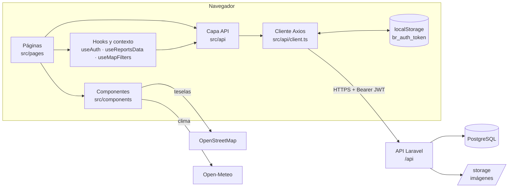

# 02 · Arquitectura e infraestructura

## Arquitectura general



| Capa | Carpeta | Responsabilidad |
|---|---|---|
| Páginas | `src/pages` | Una por ruta. Cargan datos y componen la pantalla. |
| Componentes | `src/components` | Piezas reutilizables (ver documentos 04 a 06). |
| Estado global | `src/context/AuthContext.tsx` | Sesión y perfil del usuario. |
| Hooks | `src/hooks` | Lógica compartida entre páginas (datos del mapa, filtros). |
| Capa API | `src/api` | Una función por endpoint; nunca lanza excepciones, devuelve `{ data, error }`. |
| Tipos | `src/types/index.ts` | Modelos de datos que devuelve la API. |

Servicios externos (sin clave): **OpenStreetMap** para las teselas del mapa y **Open-Meteo** para el clima del panel ciudadano.

---

## Sesión

### Inicio de sesión

1. `LoginPage` llama a `login(email, password)` de `useAuth()`.
2. `AuthContext` llama a `signIn()` → `POST /auth/login`, guarda el token con `setToken()` (clave `br_auth_token` en `localStorage`) y el perfil en estado.
3. Se muestra la animación de bienvenida y se redirige con `homePathForRole(rol)`:

| Rol | Destino |
|---|---|
| `administrador` | `/admin` |
| `entidad` | `/entity/dashboard` |
| `ciudadano` / `moderador` | `/user` |

### Al recargar la página

`AuthProvider` llama a `refreshProfile()` → `GET /auth/me`. Si hay token válido, restaura el perfil; si no, queda sin sesión. Mientras tanto `loading = true` y `ProtectedRoute` muestra un indicador de carga.

### Renovación automática del token

El interceptor de respuestas de `src/api/client.ts`:

1. Si una petición responde **401** y hay token, llama una sola vez a `POST /auth/refresh` (si varias peticiones fallan a la vez, comparten la misma renovación) y repite la petición original con el token nuevo.
2. Si la renovación falla, o la API responde **403 `cuenta_inactiva`**, borra el token y emite el evento `auth:expired`.
3. `AuthContext` escucha `auth:expired`, borra el perfil y muestra un toast "Sesión finalizada" con el motivo (por ejemplo, la razón de la suspensión).

Las rutas públicas de autenticación (`/auth/login`, `/auth/register`…) quedan fuera del interceptor: sus 401/403 son respuestas esperadas.

### Cierre de sesión

En el panel ciudadano (menú lateral y Mi perfil) primero se muestra `LogoutAnimation`; al terminar, `logout()` llama a `POST /auth/logout`, borra el token y se navega a `/`. Ese orden evita que `ProtectedRoute` redirija a `/login` en medio de la animación. El panel de administración cierra la sesión sin animación y navega a `/login`.

### Protección de rutas

`ProtectedRoute` (en `routes.tsx`) envuelve los grupos privados:

- Sin sesión → `/login`.
- Con un rol no permitido → al panel de su rol (`homePathForRole`).

La protección real está en la API: el frontend solo evita mostrar pantallas que el usuario no podría usar.

---

## Modelos de datos (`src/types/index.ts`)

Espejo de las tablas del backend ([diagrama entidad-relación](../backend/02-BASE-DE-DATOS.md)).

| Tipo | Tabla | Campos clave |
|---|---|---|
| `Perfil` | `users` | `id`, `email`, `nombre_completo`, `url_avatar`, `rol`, `estado`, `motivo_bloqueo`, `puntuacion_reputacion`, `reportes_creados`, `reportes_resueltos`, `id_entidad` |
| `Entidad` | `entidades` | `nombre`, `slug`, `tipo`, `color`, `logo_url`, `esta_activa` |
| `Reporte` | `reportes` | `titulo`, `descripcion`, `categoria` (nombre), `latitud` / `longitud` (texto), `url_imagen`, `estado`, `prioridad`, `votos_*`, `visible`; incluye `perfiles` (autor) y `entidades` |
| `Mensaje` | `mensajes` | `id_reporte`, `tipo_remitente`, `mensaje`, `perfiles` |
| `Notificacion` | `notificaciones` | `tipo`, `titulo`, `mensaje`, `esta_leida`, `id_reporte` |
| `Noticia` | `noticias` | `titulo`, `contenido`, `url_imagen`, `categoria`, `esta_publicada`, `fecha_publicacion`, `entidades` |
| `Servicio` | `servicios` | `nombre`, `tipo`, `latitud`, `longitud`, `direccion`, `horario`, `telefono`, `esta_activo` |
| `CategoriaReporte` | `categorias_reportes` | `nombre`, `icono`, `color`, `id_entidad` |
| `Insignia` / `InsigniaUsuario` | `insignias` / `insignias_usuarios` | `nombre`, `descripcion`, `icono`, `requisito_texto`; `fecha_obtencion`. `src/api/badges.ts` define `InsigniaObtenida` (insignia + fecha). |
| `VotoReporte` | `votos_reportes` | `id_reporte`, `id_usuario`, `tipo_voto` |
| `HistorialReporte` | `historial_reportes` | `accion`, `valor_anterior`, `valor_nuevo` |

Tipos de unión principales:

```ts
type RolUsuario = 'ciudadano' | 'entidad' | 'moderador' | 'administrador';
type EstadoUsuario = 'activo' | 'inactivo' | 'suspendido';
type EstadoReporte = 'pendiente' | 'en_revision' | 'en_proceso' | 'resuelto' | 'cancelado';
type PrioridadReporte = 'baja' | 'media' | 'alta' | 'critica';
```

> Las claves `perfiles` y `entidades` dentro de un reporte se conservan de la época de Supabase; el backend las devuelve con esos nombres a propósito.

---

## Notificaciones

No hay websockets. `NotificationBell` consulta `GET /users/me/notifications` **cada 30 segundos** y reproduce `public/notification.mp3` cuando llega una nueva.

## Imágenes

Las subidas (foto de reporte, avatar, logo de entidad, imagen de noticia) se envían como `multipart/form-data` a la API, que devuelve la URL pública (`APP_URL/storage/...`). Para que se vean, el backend necesita `php artisan storage:link`.

## Despliegue

`npm run build` genera `dist/`, que se sirve como sitio estático. `.github/workflows/frontend-deploy.yml` lo sube a `/var/www/ds1/buenaventura-reporta/html` por SSH en cada push a `main`. Detalles y advertencias en la [guía de instalación](GUIA-DE-INSTALACION.md#8-compilar-y-desplegar).
